# koipond 🎏

[](https://github.com/pillowtalk-Qy/koipond/actions/workflows/ci.yml)
[](https://github.com/0xydev/koipond)
[](https://www.typescriptlang.org/)
[](https://nodejs.org/)
[](https://vitest.dev/)
[](LICENSE)
[](#contributing)

> [!IMPORTANT]
> **Project lineage:** this repository is derived from
> [0xydev/koipond](https://github.com/0xydev/koipond). The original concept, visual language,
> renderer and initial implementation were created by [@0xydev](https://github.com/0xydev).
> Qy's `original-plus` edition preserves that foundation while adding persistent ecology,
> replay-safe feeding, verifiable state provenance, and a solar-time and four-season environment
> layered onto the original pond rather than replacing its style or mechanics.
> See [NOTICE.md](NOTICE.md) for the full attribution.

Turn your GitHub contribution graph into a living koi pond, seen from above.

**Try Qy's persistent edition with any public username:
[pillowtalk-Qy.github.io/koipond](https://pillowtalk-qy.github.io/koipond/)**

The original edition remains available at
[0xydev.github.io/koipond](https://0xydev.github.io/koipond/).

<picture>
  <source media="(prefers-color-scheme: dark)" srcset="assets/demo-dark.svg">
  
</picture>

Your contributions become plankton: bigger and brighter the more you commit. Fish paths come from
a deterministic steering-force simulation (momentum, capped turning force, a gentle wander), and
each body is drawn as the fish's own trail: a dense run of translucent circles replaying the head's
path a beat later, with a grow-then-taper size profile and alpha fading toward the tail. In a turn
the body wraps the curve, because the body *is* the curve. Fish graze the year clean; when the pond
empties, night falls and the ecosystem regrows in a seamless loop. Every bite sends a ripple across
the water.

The graph does not just feed the fish, it shapes the ecosystem:

- **Fish count, species and size** respond to active days, contribution energy and consistency.
- **Contribution levels carry energy**: richer plankton changes target choice, swimming pace and satiety.
- **Fish persist between days**: identity, markings and earned growth survive each nightly refresh.
- **Koi and minnows behave differently**: koi favor high-energy food while minnows favor dense grazing areas.
- **The pond has physical relationships**: fish separate from one another, minnows school and all fish avoid lily pads.
- **A resident turtle** crosses every pond; a 30+ day streak earns its full winter trail. 🐢
- **A 21+ day quiet stretch** makes a lotus bloom over its center. 🪷
- **Dark mode is bioluminescent**: an abyssal pond, twinkling plankton, glowing spirit koi.
- **The original light and dark ponds form one 24-hour cycle**: the sun's height and direction move
  the original rays, caustics, surface sheen and shadows through dawn, daylight, dusk and night.
- **The year moves continuously through four physical ecologies**: spring keeps the original pond,
  summer fills its lily pads with flowers, and individual maple leaves cross the autumn surface
  with their own drift, rotation and wake. Winter ice and snow become real obstacles that fish route
  around; the resident turtle slows at the edge and climbs onto the ice. A streak pond preserves
  each snow track before the turtle splashes back into the water instead of passing beneath it.

This `original-plus` branch deliberately keeps the original composition and art direction. Its changes
are behavioral: the same contribution graph now produces a more causal ecosystem instead of adding
new panels, labels or decorative species. Viewers who prefer reduced motion receive a complete still
pond with the fish placed along their real paths.

The published `pond-state.json` is intentionally small and auditable. It contains the public daily
contribution levels, deterministic fish identities and cumulative feeding energy. It never stores
repository names, commit messages, private counts or visitor data. A repeated run over the same
calendar cannot feed the fish twice; only newly visible energy changes the state. Every revision
contains SHA-256 digests of its source calendar, complete state and preceding revision. The same
provenance is embedded in the SVG's `<metadata>` element.

Everything is baked into a self-contained animated SVG (CSS keyframes, no JavaScript), so it works
anywhere GitHub renders images, including profile READMEs. Because GitHub does not execute JavaScript
inside README images, the Action refreshes the solar-time snapshot every hour; the animation itself
continues locally inside that snapshot.

## Usage (GitHub Action)

Five minutes, four steps, no local setup:

1. Create your profile repository if you do not have one yet: a public repo named exactly after
   your username (for example `octocat/octocat`). Its README is what visitors see on your profile.
2. In that repo, create the file `.github/workflows/koipond.yml` with the workflow below (GitHub
   web UI: Add file, Create new file, paste, commit).
3. Go to the Actions tab, pick `koipond`, press `Run workflow` once. This generates the first SVGs
   on an `output` branch. After that it refreshes itself every hour.
4. Paste the `` snippet below into your README, replacing `<user>/<repo>`.

```yaml
name: koipond
on:
  schedule:
    - cron: "17 * * * *"
  workflow_dispatch:

permissions:
  contents: write

jobs:
  generate:
    runs-on: ubuntu-latest
    steps:
      - uses: pillowtalk-Qy/koipond@ba591eec11289c4a9c6a6f608d97af854f5cb6a8
        with:
          github_user_name: ${{ github.repository_owner }}
          outputs: |
            dist/koipond.svg?environment=auto&timezone=480&latitude=22.3193&longitude=114.1694
      - uses: crazy-max/ghaction-github-pages@df5cc2bfa78282ded844b354faee141f06b41865 # v4
        with:
          target_branch: output
          build_dir: dist
        env:
          GITHUB_TOKEN: ${{ secrets.GITHUB_TOKEN }}
```

Then embed the generated pond in your README:

```html
/<repo>/output/koipond.svg">
<br>
<sub>This pond follows Hong Kong time and season. Contributions feed it; its fish remember. · <a href="https://raw.githubusercontent.com/<user>/<repo>/output/pond-state.json">verify state</a></sub>
```

Each `outputs` line accepts options as a query string, and can be a `.svg`, `.gif` or `.mp4`:

```yaml
outputs: |
  dist/koipond.svg?environment=auto&timezone=480&latitude=22.3193&longitude=114.1694
  dist/koipond-light.svg
  dist/koipond-dark.svg?theme=dark
  dist/koipond.gif?theme=dark&fps=10&start=10&dur=8
```

| Option | Meaning |
| --- | --- |
| `theme` | `light` (default) or `dark` |
| `seed` | Any string, changes fish variety and routes (defaults to the username) |
| `environment` | Set to `auto` to derive a continuous solar-time and seasonal pond |
| `timezone` | UTC offset in minutes for the automatic pond (`480` is Hong Kong) |
| `latitude` | Latitude used to calculate daylight (`22.3193` is Hong Kong) |
| `longitude` | Longitude used to calculate true solar time (`114.1694` is Hong Kong) |
| `date` | Optional reproducible date override in `YYYY-MM-DD` form |
| `time` | Optional reproducible local-time override in `HH:MM` form |
| `season` | Optional visual test override: `spring`, `summer`, `autumn` or `winter` |
| `fps` | Video frame rate up to 60 (gif and mp4 only, default 10 for gif, 30 for mp4) |
| `start` | Capture start time in seconds into the loop (default 0) |
| `dur` | Capture length in seconds (default: the full loop) |
| `scale` | Resolution multiplier (default 1 for gif, 2 for mp4) |

The Action also writes `dist/pond-state.json`. Because the workflow publishes the complete `dist`
directory to `output`, the next hourly run restores it automatically. The optional Action inputs
`state_file`, `state_branch` and `state_path` change those locations.

The workflow pins Qy's `original-plus` implementation to a full commit SHA for reproducibility.
To use the original edition instead, follow the setup guide in
[0xydev/koipond](https://github.com/0xydev/koipond#usage-github-action).

GIF and MP4 outputs use a headless Chromium browser and ffmpeg. Both are preinstalled on GitHub
runners, so they just work in the Action. Locally you need Chrome or Edge plus ffmpeg on PATH.

## Quick start

```sh
git clone https://github.com/pillowtalk-Qy/koipond.git
cd koipond
npm install
npm run demo          # generates dist/koipond-{light,dark}.svg + dist/preview.html
```

Open `dist/preview.html` in a browser to watch both themes.

Generate your own pond (no token needed, works with any public profile):

```sh
npx tsx src/cli.ts --user <your-github-login>
```

With a token you get exact contribution counts instead of levels:

```sh
npx tsx src/cli.ts --user <login> --token <token>
```

Preserve fish identity and growth across local runs:

```sh
npx tsx src/cli.ts --user <login> --state dist/pond-state.json
```

Generate the same automatic Hong Kong environment used by the profile workflow:

```sh
npx tsx src/cli.ts --user <login> --environment --timezone-offset 480 --latitude 22.3193 --longitude 114.1694
```

Verify a downloaded state independently:

```sh
npm run verify:state -- dist/pond-state.json
```

To verify one revision links to an earlier state retrieved from Git history:

```sh
npm run verify:state -- pond-state.json previous-pond-state.json
```

| Flag | Meaning |
| --- | --- |
| `--user` | GitHub login to fetch the contribution calendar for |
| `--token` | GitHub token, falls back to `GITHUB_TOKEN` env (optional) |
| `--demo` | Use generated demo data instead of the API |
| `--seed` | Override the PRNG seed (defaults to the username) |
| `--theme` | `light`, `dark` or `both` (default `both`) |
| `--environment` | Generate one solar-time and season-aware `koipond-auto.svg` |
| `--date`, `--time` | Optional fixed environment moment for previews or reproducible builds |
| `--timezone-offset` | UTC offset in minutes (default `480`, Hong Kong) |
| `--latitude` | Latitude used for solar altitude (default `22.3193`) |
| `--longitude` | Longitude used for true solar time (default `114.1694`) |
| `--season` | Optional season override for visual testing |
| `--out` | Output directory (default `dist`) |
| `--video` | Also render a `.gif` or `.mp4` of the loop, with the same query options (`pond.mp4?fps=60`) |
| `--state` | Read and update a persistent pond-state JSON file (optional) |

## How it works

1. **Data**: GitHub GraphQL `contributionCalendar`, the public contributions page (no token), or a
   deterministic demo generator.
2. **State** (`src/state.ts`): compares the public calendar with the previous published snapshot,
   preserves fish identity and credits only new energy. Canonical JSON and SHA-256 bind the source
   calendar, complete state and previous revision into an independently verifiable chain.
3. **Ecology** (`src/ecology.ts`): contribution levels become conserved energy, activity patterns
   become stable ecosystem traits, and lily-pad and winter-ice geometry are shared by rendering
   and path planning.
4. **Environment** (`src/environment.ts`): calculates solar altitude from date, local time,
   latitude, longitude and the equation of time; drives directional rays, caustics, shadows and
   surface activity while blending the original light/dark palettes; and derives narrow,
   overlapping seasonal weights for blooms, maple drift, ice coverage and winter stillness.
5. **Planner** (`src/planner.ts`): a seeded steering-physics simulation. Fish accelerate under a
   capped force toward their next plankton, change pace with satiety, separate, school, avoid pond
   obstacles and bounce softly off the walls. Deterministic, so the same grid + seed always bakes
   the same film.
6. **Renderer** (`src/render/svg.ts`): bakes the simulated paths into CSS `@keyframes` (decimated on
   straightaways), draws bodies as delayed trails, and quantizes eat times into 0.5% buckets so
   hundreds of plankton share ~100 keyframe blocks, keeping file size down.

## Roadmap

- [x] Steering-physics fish over the contribution field, light and dark themes
- [x] Energy, satiety, schooling, separation and lily-pad avoidance
- [x] Accessible static pond for reduced-motion visitors
- [x] Cross-day fish identity, growth and replay-safe feeding state
- [x] SHA-256 state provenance, SVG metadata and standalone verification
- [x] GitHub Action packaging with persistent state and query-string options
- [x] GIF and MP4 output (headless browser capture)
- [x] Continuous 24-hour solar direction, light, dawn, dusk and night from the original two palettes
- [x] Four-season ecology with summer blooms, autumn maple drift and interactive winter ice
- [ ] More species, decor unlocked by achievements, GitLab support

## Contributing

Contributions are welcome! Feel free to open an issue for bugs and ideas, or send a PR directly.
To get started:

```sh
npm install
npm run demo          # see your changes in dist/preview.html
npm run typecheck
npm test
```

New species, decor, themes and achievement rules are all good first issues: species live in
`src/render/fish.ts`, decor in `src/render/decor.ts`, colors in `src/render/palette.ts`.

## License

This derivative remains available under the [MIT License](LICENSE). The original copyright notice
for 0xydev is preserved. See [NOTICE.md](NOTICE.md) for project lineage and modification scope.
